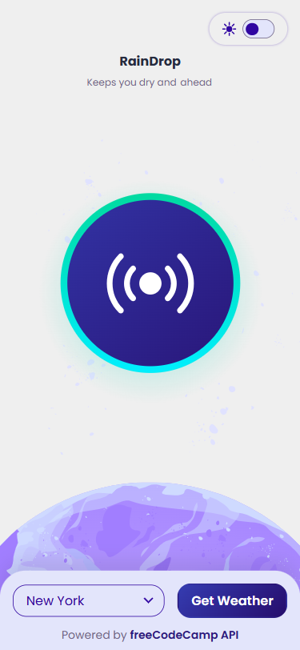
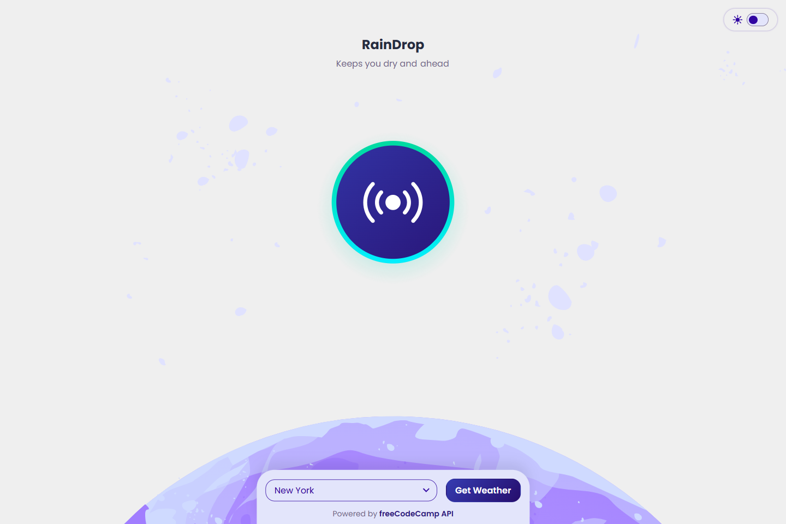
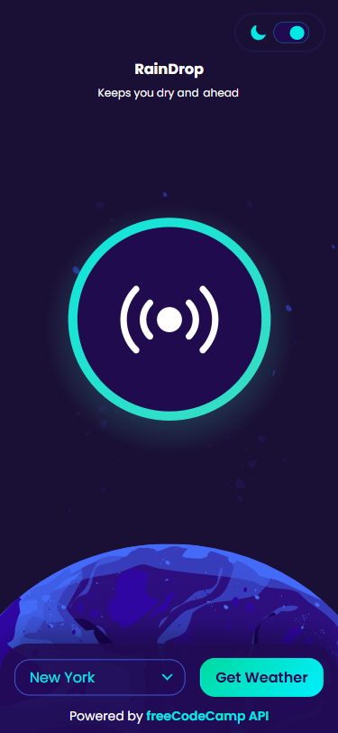
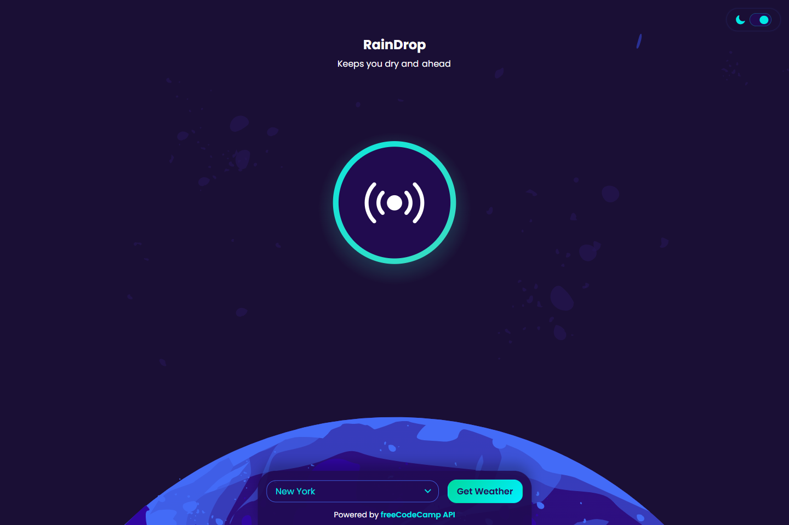

# 💻 RainDrop

## ℹ️ RainDrop: An Interactive Weather App that Utilizes FCC's Weather API

| _Mobile Preview (375x812)_                                   | _Desktop Preview (1440x960)_                                    |
| ------------------------------------------------------------ | --------------------------------------------------------------- |
|       |       |
|  |  |

RainDrop is a lightweight, accessible weather application built with **vanilla HTML, CSS, and JavaScript**.  
It uses the **freeCodeCamp Weather API** to fetch a non-live weather data and displays it in a responsive, mobile-first interface.

Created and inspired from the lab challenges of [**freeCodeCamp.org**](https://www.freecodecamp.org/learn/full-stack-developer/) JavaScript course.

---

## 🔍 Overview

RainDrop combines clean UI design, accessibility practices, and JavaScript modularization into one project.  
The app demonstrates how to structure code across modules for easier maintainability, and how to integrate API data into a responsive web app.

---

## ✨ Features

- Fetches weather data from the **freeCodeCamp Weather API**
- Theme toggle support enabled
- Surprise button that plays/pauses a song track with ARIA state management
- Dynamic image and data loading
- Keyboard navigation with skip links and focus-visible states
- Fully responsive, mobile-first layout
- Accessibility-first approach (ARIA attributes, semantic HTML, reduced motion support)

---

## 🧠 What I Learned

- Strengthened my knowledge with JavaScript modules (`api.js`, `ui.js`, `weather.js`, `theme.js`)
- Handling asynchronous data fetching with `fetch()` and error management
- Improving UI/UX with loading states, transitions, and reduced motion handling
- The use of `<link rel="preload" />` in HTML to preload immediately used assets such as fonts on first page load
- Learned how to customized HTML elements such as `<select>` and `<option>` based on the site's theme

---

## 🛠️ Tech Used

- HTML5
- CSS3
- JavaScript
- Git
- GitHub
- Netlify

---

## 🎨 Design Reference & Tools

- Figma

---

## 🚀 How to Run

1. Clone the repository
2. Open `index.html` in your browser

---

## 🌐 Live Demo

Or you can check out the 👉 [live website here](https://raindrop-fcc-jiro.netlify.app/)

---

## 📊 Performance Report

A **Google Lighthouse** audit was conducted on the final version of this project. You can view the full report [here](./assets/downloads/lighthouse-performance-report.pdf).

---

## 🧑‍💻 Author

Created by **Elmar Chavez**

🗓️ Month/Year: **August 2025**

📚 Journey: **5th** month of learning _frontend web development_.
